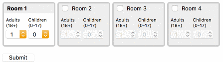

## Hotel State Management using React Hooks Demo
This project was bootstrapped with [NextJS](https://github.com/zeit/next.js/).

## Requirements
1. By default, the 'Adult' and 'Children' drop-down fields for rooms 2, 3, and 4 should be disabled.  Upon checking the checkbox of room 2, the drop-down fields associated with room 2 should be enabled.  

2. Any room that is checked should have a selected state, whose presentation is identical to the 'Room 1' field, and it's corresponding Adults/Children drop-down fields should be enabled.

3. Any room that is unchecked should return to the unselected state, and it's corresponding Adults/Children drop-down fields should become disabled and return to default values.

4. If a user unchecks a room, that room and all consecutive rooms should return to its unselected, disabled state.

5. Upon clicking 'Submit', save values using localStorage, so that upon reload, all previously selected values are pre-populated.

## Developer Notes
1. NextJS was chosen to build a single-page javascript app with server-side rendering. As per request. It also includes yarn for faster installation of dependencies.
2. Initial room data is provided for props from the room_data.js file.
3. Components contain their corresponding styles in separate scss files with the help of the @zeit/next-sass plugin.
4. State management of the user inputs is handled by React's hooks using useState() and useEffects() methods.
5. WAI-ARIA adherence is done using semantic html tags and corresponding for/id attributes for user inputs.
6. No visual feedback is provided upon form submission as it was not in the requirements, however a page refresh will load data from localStorage if it exists.
7. Note that additional config parameters were added to enable jest/enzyme testing. See `jest.config.js` and `jest.setup.js`.

## Available Scripts
### Install dependencies using `yarn install`, NOT `npm install`!

In the project directory, you can run:

### `yarn dev`

Runs the app in the development mode. 
Open [http://localhost:3000](http://localhost:3000) to view it in the browser.

### `yarn test`

Runs unit tests (verbose output) build with Jest and Enzyme.
